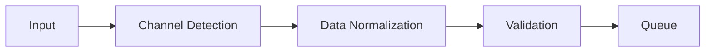
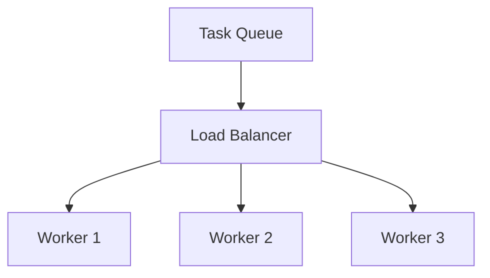
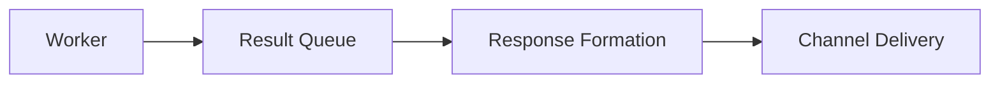

# AI-Driven Multi-Channel Customer Service Platform Architecture

## System Overview

The platform implements a distributed, AI-driven customer service system with three primary layers:
1. Data Ingestion Layer
2. AI Processing Layer
3. Multi-channel Delivery Layer

### High-Level Architecture Diagram
```
┌─────────────────────┐
│   Input Channels    │
│  ┌───┐ ┌───┐ ┌───┐ │
│  │Voice│Chat│Email│ │
│  └─┬─┘ └─┬─┘ └─┬─┘ │
└────┼────┼────┼────┘
     │    │    │
┌────▼────▼────▼────┐
│  Data Ingestion    │
│     Layer          │
└────────┬──────────┘
         │
┌────────▼──────────┐
│   AI Processing    │
│      Layer         │
└────────┬──────────┘
         │
┌────────▼──────────┐
│ Multi-channel      │
│  Delivery Layer    │
└──────────────────-┘
```

## Core Components

### 1. Data Ingestion Layer

```python
class DataIngestionLayer:
    def process_input(channel_type, data):
        # Normalize data format
        # Handle channel-specific preprocessing
        # Ensure data quality
```

Key Features:
- Channel-specific data processing
- Data normalization
- Input validation
- Rate limiting
- Error handling

### 2. AI Processing Layer

#### Sentiment Analysis
Implementation of paper's equations:

```python
# Softmax Function for NLP Classification
P(y|x) = exp(θ_y^T φ(x)) / Σ(exp(θ_{y'}^T φ(x)))

# Gradient Descent Update Rule
w_{t+1} = w_t - η ∇_w L(w)
```

Components:
```python
class SentimentAnalyzer(nn.Module):
    def __init__(self, input_size, hidden_size, num_classes):
        self.layer1 = nn.Linear(input_size, hidden_size)
        self.layer2 = nn.Linear(hidden_size, hidden_size)
        self.layer3 = nn.Linear(hidden_size, num_classes)
```

#### Intelligent Routing
```python
class IntelligentRouter:
    def route_request(self, data):
        # Priority-based routing
        # Load balancing
        # Agent availability check
```

### 3. Distributed System Architecture

#### Worker Architecture
```python
class Worker:
    def __init__(self, worker_id):
        self.sentiment_analyzer = SentimentAnalyzer()
        self.router = IntelligentRouter()
        self.queue_manager = QueueManager()

    async def run(self):
        while self.running:
            task = self.queue_manager.pop_task('tasks')
            result = await self.process_task(task)
```

#### Queue Management
```python
class QueueManager:
    def __init__(self):
        self.redis_client = redis.Redis(
            host='localhost',
            port=6379
        )
```

## Data Flow

1. Input Processing:


2. Task Distribution:


3. Result Processing:


## Performance Optimization

### 1. Load Balancing
- Round-robin task distribution
- Worker health monitoring
- Dynamic scaling

### 2. Caching Strategy
```python
class CacheManager:
    def __init__(self):
        self.redis_client = redis.Redis()
        self.cache_ttl = 3600  # 1 hour

    def get_cached_response(self, query_hash):
        return self.redis_client.get(query_hash)
```

### 3. Error Handling
```python
class ErrorHandler:
    def handle_error(self, error_type, context):
        # Log error
        # Implement retry logic
        # Notify monitoring system
```

## Monitoring and Metrics

### 1. System Metrics
- Response time
- Queue lengths
- Worker status
- Error rates

### 2. Business Metrics
- Customer satisfaction scores
- Resolution time
- Channel performance
- Sentiment distribution

## Scaling Considerations

### 1. Horizontal Scaling
- Worker pool expansion
- Redis cluster configuration
- Load balancer distribution

### 2. Vertical Scaling
- Worker resource allocation
- Queue optimization
- Cache size management

## Security Measures

### 1. Data Protection
- Input validation
- Rate limiting
- Access control

### 2. System Security
- Worker authentication
- Queue encryption
- Secure communication

## Configuration Management

```python
class Settings:
    REDIS_HOST: str = "localhost"
    REDIS_PORT: int = 6379
    WORKER_COUNT: int = 3
    QUEUE_TIMEOUT: int = 30
```

## Deployment Architecture

```
┌─────────────────┐    ┌─────────────────┐
│   API Gateway   │◄──►│  Load Balancer  │
└───────┬─────────┘    └────────┬────────┘
        │                       │
┌───────▼─────────┐    ┌───────▼────────┐
│  Worker Pool    │◄──►│  Redis Cluster  │
└─────────────────┘    └────────────────┘
```

## Implementation Details

### 1. Worker Implementation
```python
async def process_task(self, task):
    if task['type'] == 'sentiment_analysis':
        return await self.process_sentiment(task['data'])
    elif task['type'] == 'routing':
        return await self.process_routing(task['data'])
```

### 2. Queue Management
```python
def push_task(self, queue_name: str, task: Dict[str, Any]):
    return self.redis_client.lpush(queue_name, json.dumps(task))

def pop_task(self, queue_name: str):
    task = self.redis_client.brpop(queue_name, timeout=1)
    return json.loads(task[1]) if task else None
```

## Future Enhancements

1. Real-time Analytics
   - Live dashboard
   - Predictive analytics
   - Performance forecasting

2. Advanced Features
   - Multi-language support
   - Voice recognition
   - Video chat integration

3. System Improvements
   - Auto-scaling
   - Fault tolerance
   - Geographic distribution