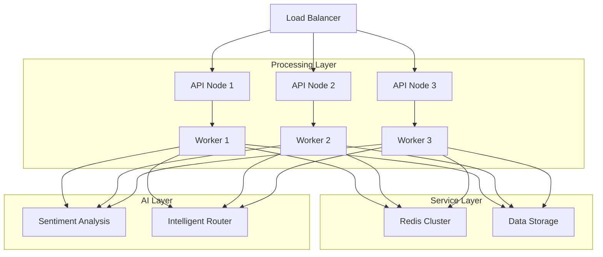

# Cloud System Architecture

## Overview
The AI-Driven Customer Service Platform utilizes cloud infrastructure to enhance scalability, reliability, and performance. This document outlines the cloud architecture components and their interactions.

## Architecture Diagram

## Component Details

### 1. Frontend Layer
- **Load Balancer**
  - Distributes incoming traffic
  - Ensures high availability
  - Manages SSL termination
  - Health checks on API nodes

- **API Nodes**
  - Handle incoming requests
  - Process authentication
  - Route requests to workers
  - Monitor system health

### 2. Processing Layer
- **Worker Nodes**
  - Execute core processing tasks
  - Scale horizontally based on demand
  - Process sentiment analysis requests
  - Handle routing decisions

- **Redis Cluster**
  - Manages distributed queues
  - Handles caching
  - Enables real-time communication
  - Maintains session state

### 3. AI Service Layer
- **Sentiment Analysis**
  - Processes customer messages
  - Implements NLP models
  - Provides sentiment scores
  - Handles multiple languages

- **Intelligent Router**
  - Implements routing logic
  - Manages load distribution
  - Optimizes response times
  - Tracks service metrics

## Performance Characteristics

### Scaling
- Automatic scaling based on:
  - CPU utilization (>70%)
  - Memory usage (>80%)
  - Request queue length
  - Response time thresholds

### High Availability
- Multiple API nodes
- Redundant worker processes
- Cross-zone deployment
- Automated failover

### Monitoring
- Real-time metrics
- Performance tracking
- Error logging
- Resource utilization

## Integration Points

### External Systems
- Customer communication channels
- Authentication services
- Monitoring systems
- Logging services

### Internal Components
- Sentiment analysis models
- Routing algorithms
- Data storage systems
- Message queues

## Security Considerations

### Network Security
- VPC configuration
- Security groups
- Network ACLs
- SSL/TLS encryption

### Data Security
- Encryption at rest
- Encryption in transit
- Access control
- Audit logging

## Cost Optimization

### Resource Management
- Auto-scaling policies
- Resource scheduling
- Spot instance usage
- Storage tiering

### Performance Tuning
- Cache optimization
- Query optimization
- Load balancing
- Connection pooling

## Deployment Guidelines

### Prerequisites
- Container registry access
- Kubernetes cluster
- Redis cluster
- Network configuration

### Configuration
- Environment variables
- Service endpoints
- Resource limits
- Scaling policies

### Monitoring Setup
- Metrics collection
- Alert configuration
- Log aggregation
- Dashboard setup

## Future Considerations

### Scalability
- Multi-region deployment
- Enhanced caching
- Performance optimization
- Resource efficiency

### Reliability
- Improved failover
- Better monitoring
- Enhanced backup
- Disaster recovery

For more details on specific components, refer to:
- [Main Architecture](architecture.md)
- [API Documentation](api.md)